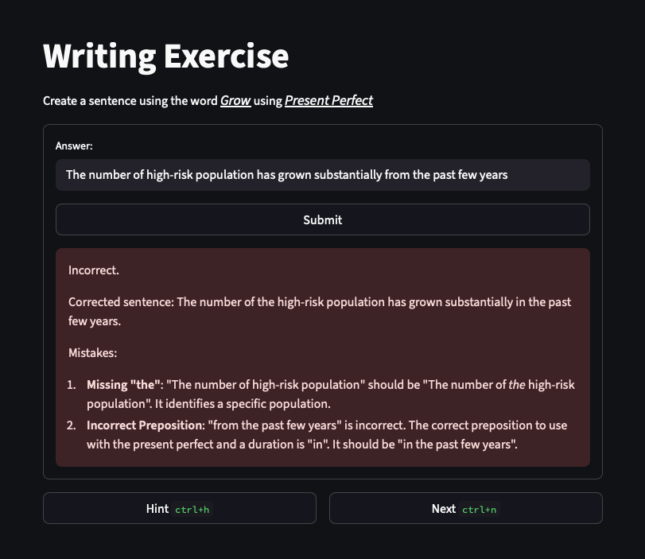

# Grammar Exercise App

## Overview
The **Grammar Exercise App** is an interactive web application designed to help users practice English grammar and vocabulary. Users are prompted to create sentences using randomly selected grammar concepts and vocabulary words, and their answers are checked for correctness using the Gemini API.

## Objectives
- Provide engaging grammar exercises for English learners.
- Help users improve their grammar and vocabulary.
- Offer instant feedback on sentence correctness using AI.

## Installation (Using Docker)
1. **Clone the repository:**
   ```bash
   git clone https://github.com/BijakRabbani/grammar-exercise.git
   cd grammar-exercise
   ```
2. **Build the Docker image:**
   ```bash
   docker build -t grammar-exercise .
   ```
3. **Run the app in a container:**
   ```bash
   docker run -p 8501:8501 --env GEMINI_API_KEY=<your_gemini_api_key> grammar-exercise
   ```
   Replace `<your_gemini_api_key>` with your actual Gemini API key.

## Usage
1. **Open the app:**
   - Visit [http://localhost:8501](http://localhost:8501) in your browser after starting the container.
2. **Input your Gemini API key:**
   - If not set as an environment variable, the app will prompt you to enter it.
3. **Start practicing:**
   - The app will display a grammar concept and a vocabulary word.
   - Write a sentence using both and submit your answer.
   - Receive instant feedback on correctness.
   - Use the "Hint" button for guidance or "Next" to try a new exercise.

## Screenshot


## Files
- `app.py`: Main application code.
- `grammar.xlsx`: Grammar concepts and examples.
- `vocabulary.xlsx`: Vocabulary words and meanings.
- `requirements.txt`: Python dependencies.
- `DockerFile`: Docker configuration.

